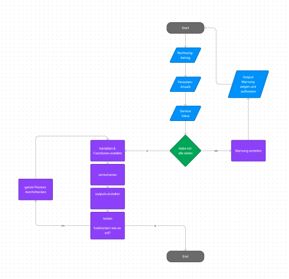
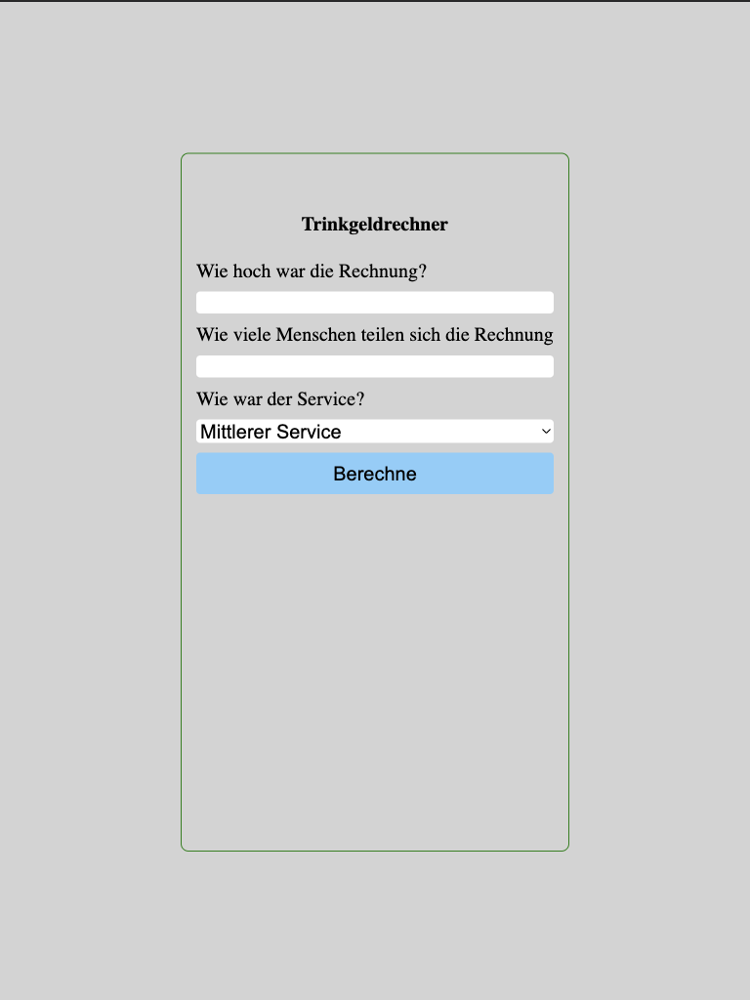

# tip-calculator

# [Flowchart](https://www.figma.com/file/LGCVQmSierHFCwTkmAGw7f/trinkeld?type=whiteboard&node-id=0-1&t=Hg8I8PFpUjqxiA32-0)

# [Deployment](https://mariariosnavarro.github.io/tip-calculator/)

